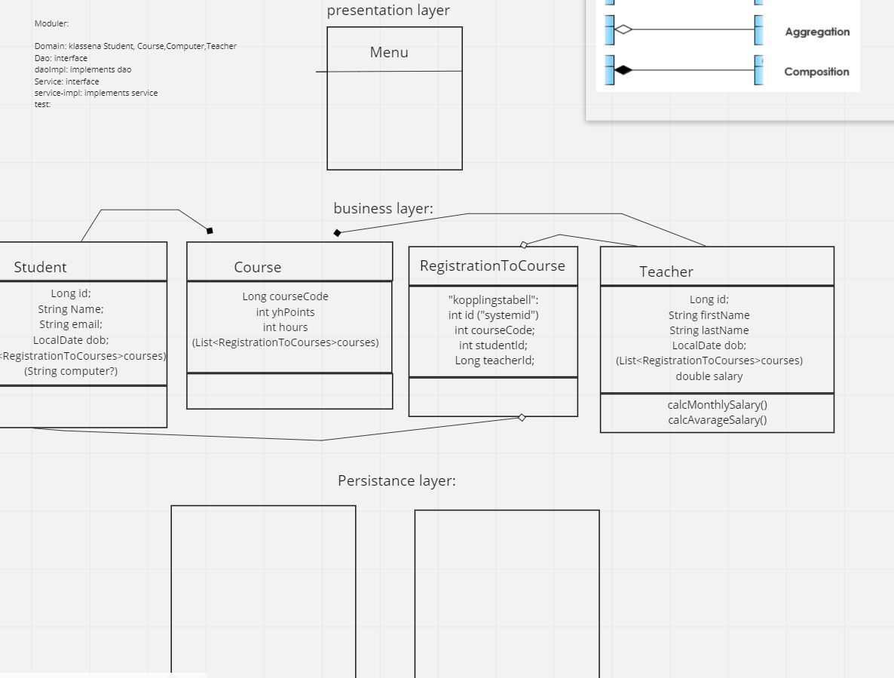

# sti--denise-jonathan-denize-
ProjectJavaB

UML:

HOW TO RUN THIS APPLICATION:
1. DOWNLOAD PostgresApp FROM https://postgresapp.com AND FOLLOW THE INSTRUCTIONS FOR DOWNLOADING
2. CREATE A DATABASE CALLED 'java' (AND GRANT ALL PRIVILEGES TO YOURSELF)
3. CONNECT TO DATABASE 'java' IN INTELLIJ
4. HIT RUN AND GO TO http://localhost:8080/swagger-ui/index.html#/

THIS IS WHAT THE APPLICATION CAN DO:
1. GET ALL STUDENTS
2. UPDATE STUDENT
3. CREATE NEW STUDENT
4. DELETE STUDENT
5. GET ALL TEACHERS
6. GET ALL COURSES
7. GET COURSES AND TEACHERS WITH RELATION
8. UNIT TEST FOR STUDENT SERVICE THAT TESTS

TODO
1. CALCULATE SALARY FOR TEACHERS
2. GET SPECIFIC STUDENT
3. ADD/DELETE COURSES FOR STUDENT CALLED 
4. UNIT TEST FOR STUDENT SERVICE THAT IS CALLED shouldThrowIllegalStateException
